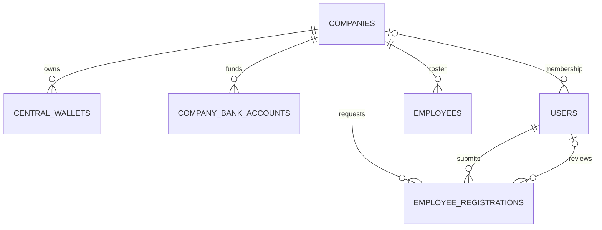
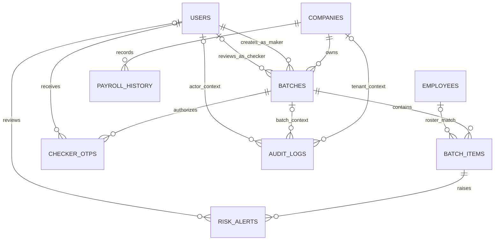
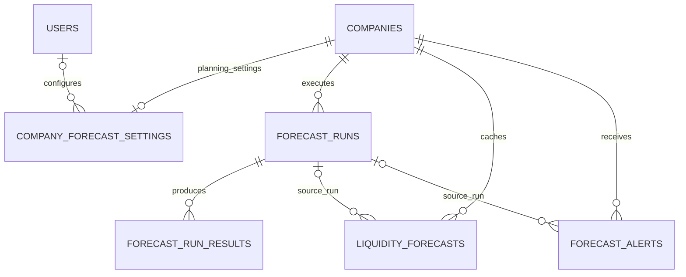

# Database relationship and cardinality reference

This document describes the 18 PostgreSQL tables in Upay Corporate Assist and
every enforced foreign-key connection. It is based on
`database/schema/01_create_schema.sql`; that script is the database source of
truth. `0..*` means zero or more records and `0..1` means an optional record.

## Cardinality notation

In the diagrams, `||` is exactly one, `o|` is zero or one, and `o{` is zero or
many. Each row below is written from the referenced parent table to the table
that contains the foreign key. The **child requirement** column describes the
number of parent records a single child may reference.

## Company and identity

| Parent → child | Foreign key in child | Parent cardinality | Child requirement | Delete behavior |
| --- | --- | --- | --- | --- |
| `companies` → `central_wallets` | `central_wallets.company_id` | A company has `0..*` wallets. | Every wallet belongs to exactly `1` company. | `CASCADE` |
| `companies` → `company_bank_accounts` | `company_bank_accounts.company_id` | A company has `0..*` funding accounts. | Every bank account belongs to exactly `1` company. | `CASCADE` |
| `companies` → `users` | `users.company_id` | A company has `0..*` users. | A user belongs to `0..1` company; platform admins can be unassigned. | `SET NULL` |
| `companies` → `employees` | `employees.company_id` | A company has `0..*` employees. | Every employee belongs to exactly `1` company. | `CASCADE` |
| `companies` → `employee_registrations` | `employee_registrations.company_id` | A company has `0..*` registration requests. | Every request belongs to exactly `1` company. | `CASCADE` |
| `users` → `employee_registrations` (submitter) | `employee_registrations.submitted_by` | A user submits `0..*` requests. | Every request has exactly `1` submitting user. | `RESTRICT` |
| `users` → `employee_registrations` (reviewer) | `employee_registrations.reviewed_by` | A user reviews `0..*` requests. | A request has `0..1` reviewer. | `SET NULL` |

## Payroll, risk, and audit

| Parent → child | Foreign key in child | Parent cardinality | Child requirement | Delete behavior |
| --- | --- | --- | --- | --- |
| `companies` → `batches` | `batches.company_id` | A company has `0..*` batches. | Every batch belongs to exactly `1` company. | `CASCADE` |
| `users` → `batches` (maker) | `batches.maker_id` | A user creates `0..*` batches. | Every batch has exactly `1` maker. | `RESTRICT` |
| `users` → `batches` (checker) | `batches.checker_id` | A user checks `0..*` batches. | A batch has `0..1` checker. | `SET NULL` |
| `batches` → `batch_items` | `batch_items.batch_id` | A batch contains `0..*` payout rows. | Every payout row belongs to exactly `1` batch. | `CASCADE` |
| `employees` → `batch_items` | `batch_items.employee_id` | An employee can match `0..*` payout rows across cycles. | A payout row matches `0..1` employee; unmatched rows remain valid data for review. | `SET NULL` |
| `batch_items` → `risk_alerts` | `risk_alerts.batch_item_id` | A payout row produces `0..*` alerts. | Every alert belongs to exactly `1` payout row. | `CASCADE` |
| `users` → `risk_alerts` (reviewer) | `risk_alerts.reviewed_by` | A user reviews `0..*` alerts. | An alert has `0..1` reviewer. | `SET NULL` |
| `batches` → `checker_otps` | `checker_otps.batch_id` | A batch has `0..*` issued OTPs. | Every OTP belongs to exactly `1` batch. | `CASCADE` |
| `users` → `checker_otps` | `checker_otps.checker_id` | A user receives `0..*` OTPs. | Every OTP is assigned to exactly `1` checker. | `CASCADE` |
| `companies` → `payroll_history` | `payroll_history.company_id` | A company has `0..*` historical payroll rows. | Every history row belongs to exactly `1` company. | `CASCADE` |
| `companies` → `audit_logs` | `audit_logs.company_id` | A company has `0..*` audit events. | An audit event has `0..1` company context. | `CASCADE` |
| `batches` → `audit_logs` | `audit_logs.batch_id` | A batch has `0..*` audit events. | An audit event has `0..1` batch context. | `SET NULL` |
| `users` → `audit_logs` | `audit_logs.user_id` | A user has `0..*` audit events. | An audit event has `0..1` actor; system events have none. | `SET NULL` |

## Liquidity forecasting

| Parent → child | Foreign key in child | Parent cardinality | Child requirement | Delete behavior |
| --- | --- | --- | --- | --- |
| `companies` → `company_forecast_settings` | `company_forecast_settings.company_id` | A company has `0..1` settings record. | Every settings record belongs to exactly `1` company. | `CASCADE` |
| `users` → `company_forecast_settings` | `company_forecast_settings.configured_by` | A user configures `0..*` settings records. | A settings record has `0..1` configuring user. | `SET NULL` |
| `companies` → `forecast_runs` | `forecast_runs.company_id` | A company has `0..*` model runs. | Every model run belongs to exactly `1` company. | `CASCADE` |
| `forecast_runs` → `forecast_run_results` | `forecast_run_results.forecast_run_id` | A model run produces `0..*` period results. | Every result belongs to exactly `1` model run. | `CASCADE` |
| `companies` → `liquidity_forecasts` | `liquidity_forecasts.company_id` | A company has `0..*` cached forecasts. | Every cached forecast belongs to exactly `1` company. | `CASCADE` |
| `forecast_runs` → `liquidity_forecasts` | `liquidity_forecasts.forecast_run_id` | A run may source `0..*` cached forecasts. | A cached forecast has `0..1` source run. | `SET NULL` |
| `companies` → `forecast_alerts` | `forecast_alerts.company_id` | A company has `0..*` forecast alerts. | Every forecast alert belongs to exactly `1` company. | `CASCADE` |
| `forecast_runs` → `forecast_alerts` | `forecast_alerts.forecast_run_id` | A run may source `0..*` alerts. | An alert has `0..1` source run. | `SET NULL` |

## Constraints that refine the relationships

- `company_forecast_settings.company_id` is `UNIQUE`, making the company-to-settings relationship one-to-zero-or-one.
- `liquidity_forecasts` is unique on `(company_id, forecast_period)`: one company cannot have two cached forecasts for the same period.
- `employees` is unique on `(company_id, phone_number)`: a phone number can occur once per company roster, but may occur in another company.
- `central_wallets` has a partial unique index on `company_id` where `wallet_type = 'MAIN'`: a company can have at most one main wallet, while it may have other wallet types.
- `accounts` has no foreign key. It is an independent mock MFS registry, joined by application validation against phone numbers rather than by a database relationship.
- `payroll_history` stores employee identity as a snapshot (`phone_number` and `employee_name`), not as an `employees.id` foreign key.
- `companies.central_wallet_balance` is a denormalized aggregate that the application synchronizes from active `central_wallets`; it is not a foreign-key relationship.

## Referential-action summary

`CASCADE` removes dependent records with their parent. `SET NULL` preserves the
dependent record but clears its optional context. `RESTRICT` prevents removal of
a user that is still the required submitter or maker of an existing record.

## Editable diagram source

The portable, validated Mermaid canonical source is
[`database_relationships.canonical.json`](database_relationships.canonical.json).
It contains the same three diagrams in a tool-friendly representation.
